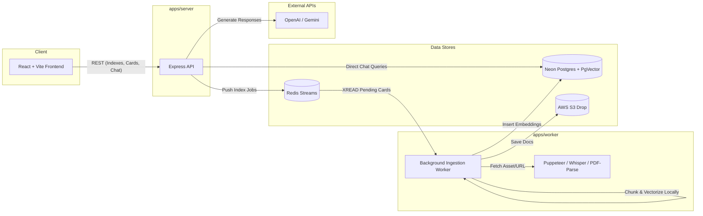

# [The Index](https://theindex.hrsht.me/)

**The Index** is a RAG (Retrieval-Augmented Generation) AI application. It allows you to create search indexes from various sources like PDFs, YouTube videos, tweets, URLs, and text, and then chat with that data using LLMs. Built as a Turborepo monorepo, it features an asynchronous ingestion pipeline backed by Redis Streams, PostgreSQL equipped with PgVector for embeddings storage, and local AI transformers for cost-efficient content processing.

Built by [Harshit](https://www.hrsht.me).

Project live at [The Index](https://theindex.hrsht.me/)

**Disclaimer: I am currently working on this, so expect incremental updates for this project.**


---

## Table of Contents

1. [High-Level Architecture](#high-level-architecture)
2. [Tech Stack](#tech-stack)
3. [Project Structure](#project-structure)
4. [Ingestion Architecture (Deep Dive)](#ingestion-architecture-deep-dive)
5. [Retrieval & Chat Architecture](#retrieval--chat-architecture)
6. [Database & Persistence Strategy](#database--persistence-strategy)
7. [API Reference](#api-reference)
8. [Frontend Architecture](#frontend-architecture)
9. [Getting Started](#getting-started)
10. [Environment Variables](#environment-variables)
11. [Available Scripts](#available-scripts)

---

## High-Level Architecture



### End-to-End Data Flows

**Ingesting a New Document:**

```
User inputs card details (e.g. YouTube URL, PDF upload)
  → POST /api/v1/index_card
  → Backend pushes command to Redis Stream (card_created)
  → Backend resolves HTTP request (Async offload)
  → Frontend reflects new 'Processing' card status

  → Worker reads from Redis Stream
  → Extracts content using specialized tools (Puppeteer, Whisper, etc.)
  → Splits text into semantic chunks
  → Embeds text chunks via local Transformers.js (Xenova)
  → Upserts chunk vectors to PostgreSQL
  → Updates card status to 'Completed' in PostgreSQL
```

**Chatting with an Index:**

```
User submits a prompt in a Chat session
  → POST /api/v1/chat/:chatId/message
  → Backend embeds the user prompt locally (Transformers.js)
  → Executes similarity search (Cosine Distance) on Postgres (PgVector)
  → Retrieves top chunks and citations
  → Sends prompt + retrieved context to LLM (OpenAI/Gemini)
  → Streams LLM response back to the client UI
```

---

## Tech Stack

| Technology                     | Role                                                  |
| ------------------------------ | ----------------------------------------------------- |
| **React + Vite**               | Frontend SPA, UI, routing                             |
| **Node.js + Express**          | Backend API router and orchestrator                   |
| **Node.js Worker**             | Background asynchronous processing                    |
| **Turborepo + pnpm**           | Monorepo build and dependency management              |
| **Neon (Serverless Postgres)** | Primary database (Indexes, Chunks, Embeddings)        |
| **PgVector**                   | PostgreSQL extension for vector similarity search     |
| **Drizzle ORM**                | Type-safe SQL query builder                           |
| **Redis Streams**              | Event bus queue for background processing             |
| **Transformers.js**            | Creating vector embeddings locally (saving API costs) |
| **Puppeteer & Readability**    | URL scraping and clean text extraction                |
| **nodejs-whisper**             | Audio and YouTube transcription                       |

---

## Project Structure

```
The-Index-AI-Rag-App/
├── apps/
│   ├── server/                 # Express REST API (Auth, Indexes, Chat Routes)
│   ├── worker/                 # Async Ingestion Engine (Scraping, Splitting)
│   └── web/                    # React Vite SPA UI (Currently under development)
│
├── packages/
│   ├── db/                     # Drizzle schema, migrations, typed db client
│   ├── redis/                  # Shared Redis connection instances
│   ├── embedder/               # Shared logic for text splitting and Transformers embeddings
│   ├── zod-schemas/            # Shared TypeScript interfaces & Zod schemas
│   ├── eslint-config/          # Shared linting rules
│   └── typescript-config/      # Shared TS configurations
│
└── docker-compose.yml          # Docker deployment manifest
```

---

## Ingestion Architecture (Deep Dive)

The `apps/worker` service acts as the resilient data digestion engine. It operates asynchronously using Redis Streams (`card_created`).

### Type-Specific Processing

The worker pulls jobs off the stream and routes them based on the `card_type`:

1. **URL & Tweets**: Loaded headless using Puppeteer and stripped of boilerplate using Mozilla Readability.
2. **Audio/YouTube**: Downloaded temporarily and passed through `nodejs-whisper` for full transcriptions.
3. **PDF & Text**: Parsed directly using `pdf-parse` or regex blocks.

### Local AI Emdeddings

To heavily optimize compute costs, the app uses **`@xenova/transformers`** locally on the Node instance to generate 384-dimensional vector embeddings (`all-MiniLM-L6-v2`) instead of paying per token to OpenAI.

### Concurrency and Safe Termination

The worker maintains an active job pool limit (Default 10). Heavier jobs (like Whisper transcription) count as 5 slots, preventing the Node instance from hitting Out-Of-Memory (OOM) errors. On `SIGTERM`, it gracefully stops consuming, sweeps the temporary `/tmp` downloaded media directories, and exits safely.

---

## Retrieval & Chat Architecture

The `apps/server` executes the synchronous user-facing chat retrieval:

1. Takes the user query and embeds it using the same local `@xenova` transformer.
2. Runs a `cosineDistance` sorting query on the `card_chunks` table within PostgreSQL (enabled by PgVector).
3. Constructs a highly contextual prompt with the retrieved text chunks.
4. Forwards the context-rich prompt to OpenAI/Gemini to generate the final response.

---

## Database & Persistence Strategy

### PostgreSQL (via Drizzle ORM & Neon)

- **Relational Data**: Securely stores `users`, `indexes`, `index_cards`, and `chats`.
- **Vector Data**: The `card_chunks` table uses the `vector(384)` data type to store the embedded sentences, allowing for sub-millisecond similarity queries across thousands of documents.

### Redis

- **Streams (`card_created`)**: Acts as a robust, non-blocking queue ensuring jobs are never lost even if the worker container dies. Uses Consumer Groups to allow scaling to multiple worker pods.

### S3 (AWS)

- Used for securely persisting and serving raw uploaded files (like PDFs or Cover Images) tied to the indexes.

---

## API Reference

### Auth

| Method | Path                  | Description                     |
| ------ | --------------------- | ------------------------------- |
| `POST` | `/api/v1/auth/signup` | Create User                     |
| `POST` | `/api/v1/auth/signin` | Authenticate and get JWT cookie |
| `POST` | `/api/v1/auth/logout` | Clear JWT cookie                |

### Indexes & Cards

| Method | Path                 | Description                                                |
| ------ | -------------------- | ---------------------------------------------------------- |
| `POST` | `/api/v1/index`      | Create a new knowledge index                               |
| `GET`  | `/api/v1/index/:id`  | Fetch an index and all structured cards                    |
| `POST` | `/api/v1/index_card` | Feed a new document (URL/PDF) into the index (async queue) |

### Chat

| Method | Path                            | Description                                    |
| ------ | ------------------------------- | ---------------------------------------------- |
| `POST` | `/api/v1/chat/:indexId`         | Create a new Chat session attached to an index |
| `POST` | `/api/v1/chat/:chatId/message`  | Submit a prompt to the RAG pipeline            |
| `GET`  | `/api/v1/chat/:chatId/messages` | Fetch history of a specific chat session       |

---

## Frontend Architecture

**Framework:** React 18 / Vite SPA (Currently in Active Development).

| Concept              | Purpose                                                                                               |
| -------------------- | ----------------------------------------------------------------------------------------------------- |
| **Routing**          | React Router (`react-router-dom`) with `ProtectedRoute` wrappers.                                     |
| **State Management** | React Query (`@tanstack/react-query`) handles fetching and caching the complex card and index states. |

---

## Getting Started

### Prerequisites

- Node.js ≥ 20
- pnpm ≥ 9
- Neon Postgres database (or local Postgres with PgVector extension enabled)
- Redis Server
- Valid LLM API Key (OpenAI / Gemini)
- AWS S3 Bucket or equivalent

### Installation

```bash
git clone https://github.com/iBreakProd/The-Index-AI-Rag-App.git
cd The-Index-AI-Rag-App
pnpm install
```

### Database Setup

```bash
pnpm --filter @repo/db db:push # Make sure to generate and apply Drizzle changes (requires database URL)
```

### Development

```bash
# Run all apps concurrently via Turborepo
pnpm dev
```

### Production Build

```bash
pnpm build
```

---

## Environment Variables

Provide `.env` files in root or respective app directories (`apps/server/.env`, `apps/worker/.env`).

| Variable                | Description                                            |
| ----------------------- | ------------------------------------------------------ |
| `DATABASE_URL`          | Postgres connection string (with PgVector)             |
| `REDIS_URL`             | Redis connection string                                |
| `S3_BUCKET`             | AWS S3 Bucket name for file drops                      |
| `AWS_REGION`            | AWS Region                                             |
| `AWS_ACCESS_KEY_ID`     | AWS Credentials                                        |
| `AWS_SECRET_ACCESS_KEY` | AWS Credentials                                        |
| `GEMINI_API_KEY`        | Gemini LLM generation                                  |
| `OPENAI_API_KEY`        | OpenAI API Key (Fallback/Alternative LLM)              |
| `JWT_SECRET`            | Secret for signing auth tokens                         |
| `HTTP_PORT`             | Backend Express Port (Default 3000)                    |
| `FRONTEND_URL`          | Allowed origin for CORS (e.g. `http://localhost:5173`) |

---

## Available Scripts

| Script        | Command                           | Description                   |
| ------------- | --------------------------------- | ----------------------------- |
| `dev`         | `pnpm dev`                        | Run all apps in watch mode    |
| `build`       | `pnpm build`                      | Compile all packages and apps |
| `start`       | `pnpm start`                      | Run compiled apps             |
| `db:generate` | `pnpm --filter @repo/db generate` | Generate Drizzle migrations   |
| `db:push`     | `pnpm --filter @repo/db push`     | Push schema directly to DB    |
